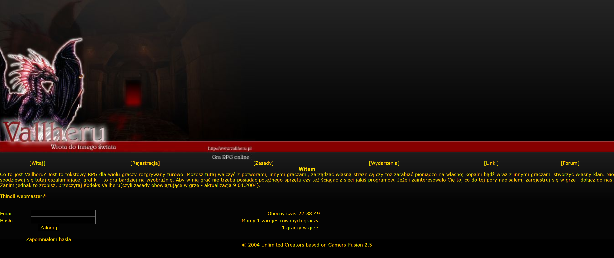
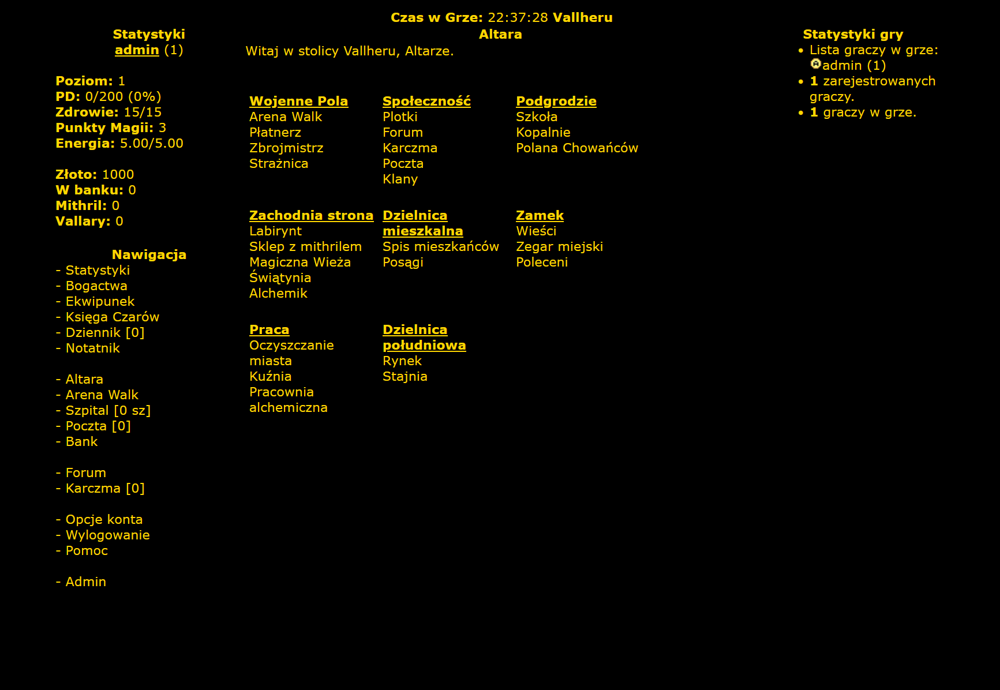
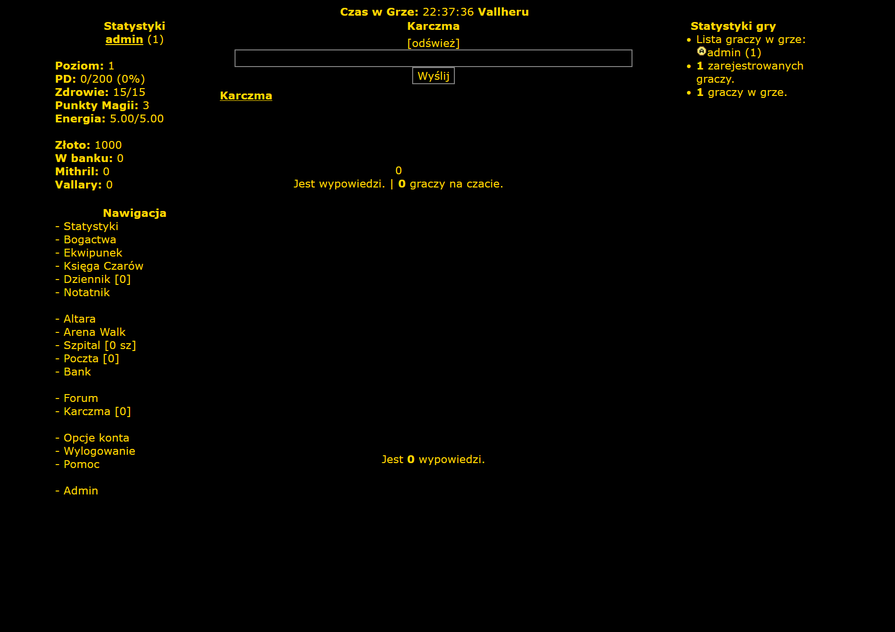
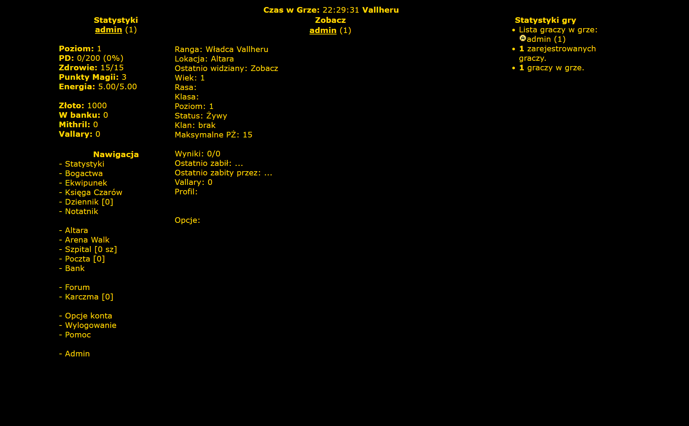

# Vallheru

This repository contains the complete history of Vallheru engine releases. The code has been ported to support the minimum versions of Docker images required for the necessary software.

## Local Startup

### Prerequisites

- Docker installed locally

To start the Vallheru, just run the `docker-compose up -d` command and wait until the engine is prepared.

To stop the engine use the following command: `docker-compose down`.

After the game is initialized use the following endpoints and credentials to manage/access game:

- MySQL credentials:
    - User: `root`
    - Password: `vallheru123`
    - Database: `vallheru`
- Game admin:
    - User: `admin`
    - Email: `admin@example.com`
    - Password: `admin`
- Game URL: `http://localhost:8080`
- PHPMyAdmin: `http://localhost:8081`

### System Requirement

- PHP 4.4.9 (Fast CGI)
- MySQL 5
- Nginx

## Gallery

  
  
  
  

